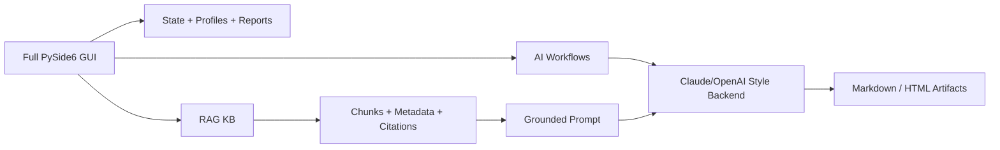

# Network GenAI Knowledge Assistant

[](https://github.com/folk00/network-genai-knowledge-assistant/actions/workflows/ci.yml)
[](https://www.python.org/)
[](https://doc.qt.io/qtforpython/)
[](https://www.langchain.com/)
[](LICENSE)

A reference project that demonstrates applied GenAI for networking, AWS
networking study workflows and infrastructure knowledge retrieval.

The project started as a full Python/PySide6 desktop application for AWS
Advanced Networking study and evolved into a safer, more explainable GenAI
architecture: deterministic app logic controls state, source selection,
retrieval and persistence; Claude/OpenAI-style models are used only as reasoning
engines inside controlled workflows.

This repository is sanitized. It does not include real certification question
banks, dumps, proprietary answer keys, customer configs, production logs,
credentials or private generated reports. Mock data is synthetic and exists only
to demonstrate the architecture.

## Why This Project Matters

Many GenAI demos are just a chat box over a model. This project shows a more
practical pattern for infrastructure work:

```text
structured/unstructured input
  -> deterministic parsing and state
  -> context selection or retrieval
  -> controlled LLM workflow
  -> grounded explanation, diagram, recommendation or review
  -> persisted report for audit and reuse
```

That same pattern maps from study workflows to real operations:

```text
quiz question / wrong answer / concept
  -> retrieve related context
  -> explain the decision path
  -> persist a review

network incident / config / MOP / log
  -> retrieve relevant runbooks and prior analysis
  -> diagnose with citations
  -> persist validation notes and next actions
```

## Main Capabilities

| Capability | What it demonstrates |
| --- | --- |
| Full PySide6 desktop app | Real GUI orchestration, state, profiles and reports |
| AI Coach / Deep Review | LLM workflows around selected question context |
| Meta-Coach | Analysis across accumulated Markdown report history |
| Concept Dossiers | Reusable generated knowledge artifacts |
| Nuclear Review | Multi-step specialist-style analysis and synthesis |
| Diagram / Teach Zero | Artifact generation from controlled context |
| RAG KB | Retrieval, citations and grounded prompt construction |
| Claude/OpenAI provider switch | Provider abstraction without hardcoding one model |
| Safety scan | Guardrail to avoid publishing secrets or private data |

## Quick Start

Install dependencies:

```powershell
pip install -r requirements.txt
```

Launch the full GUI:

```powershell
python run.py
```

On Windows, you can also double-click:

```text
start_gui.bat
```

The full GUI is the primary demo. The smaller scripts are there to make the RAG
layer easy to inspect from the command line.

## Quick Demo Path

1. Open the full GUI with `python run.py`.
2. Load a private local DOCX question bank only on your machine.
3. Load a private local override CSV if needed.
4. Explore deterministic features: profiles, wrong-answer bank, repeat-all,
   confidence tracking and reports.
5. Try the AI workflows: AI Coach, Deep Review, Nuclear Review, Diagram or
   Teach Zero.
6. Use `RAG KB`: it retrieves related context from the loaded question bank,
   excludes the current question, optionally adds sanitized knowledge docs, and
   sends a grounded review to the selected backend after confirmation.
7. Note that the public repo uses mock data and safety boundaries.

See [docs/demo_walkthrough.md](docs/demo_walkthrough.md) for a step-by-step
script.

## Architecture At A Glance



The application owns the workflow. The LLM does not own the app.

More diagrams are available in [docs/diagrams.md](docs/diagrams.md).

The application controls:

- parsing and state
- selected context
- retrieval
- metadata
- prompt shape
- report persistence
- provider selection
- user confirmation

The LLM helps with:

- explanation
- synthesis
- diagnosis
- diagram text
- study plans
- recommendation drafts

## RAG Implementation

The RAG scaffold lives under:

```text
src/network_ai_assistant/rag/
```

It includes:

- `domain.py`: source documents, chunks and retrieval results
- `ingest.py`: Markdown ingestion and chunking
- `simple_retriever.py`: deterministic keyword retriever for local demos
- `prompting.py`: grounded prompt builder with citations
- `langchain_adapter.py`: optional LangChain/vector-store adapter

Inside the full GUI, `RAG KB` builds a temporary retrieval corpus from the
currently loaded question bank and excludes the current item. This prevents the
model from simply echoing the same question and makes the feature act like a
real knowledge assistant.

For public demos, supplemental context comes from:

```text
data/mock/network_docs.md
```

For private local experiments, use:

```text
data/private/knowledge_docs.md
```

`data/private/*` is ignored by Git except for its README.

## Safe SDK Usage

The full GUI uses the same selected backend as AI Coach / Deep Review and asks
for confirmation before sending the current item and retrieved context.

The standalone SDK demo is dry-run by default:

```powershell
python .\scripts\demo_sdk_grounded_answer.py
```

To intentionally allow a live SDK call for the standalone demo:

```powershell
$env:AI_LIVE="1"
$env:AI_PROVIDER="claude_code"
python .\scripts\demo_sdk_grounded_answer.py
```

No credentials are stored in this repository. `.env`, logs, private data,
question banks and generated reports are ignored.

## Local RAG Demo Without API Keys

```powershell
python .\scripts\demo_local_rag.py
```

This uses synthetic data and a deterministic keyword retriever, so it can be
shown without paid APIs or private files.

## GUI RAG Mini Demo

```powershell
python .\scripts\gui_rag_demo.py
```

This smaller GUI is useful if you want to explain retrieval mechanics without
opening the full study app.

## Validation

Run before publishing or demoing:

```powershell
python .\scripts\safety_scan.py
python -m pytest .\tests
python -m py_compile .\run.py .\apps\full_quiz_gui\ans_c01_quiz_gui_v2_counterfix2.py
```

Expected result:

- safety scan passes
- tests pass
- Python compilation passes

## Repository Map

```text
apps/full_quiz_gui/        Full desktop app copied from the working tool
data/mock/                 Synthetic public demo data
data/private/              Local-only private input location
docs/                      Architecture and demo notes
scripts/                   Small command-line demos and safety scan
src/network_ai_assistant/  RAG, LLM and workflow scaffold
tests/                     Lightweight retrieval tests
```

See [PROJECT_STRUCTURE.md](PROJECT_STRUCTURE.md) for a fuller map.

## What Is Not Included

This repository intentionally excludes:

- real certification question banks
- dumps or protected answer keys
- customer configs
- production logs
- API keys
- local Claude/OpenAI auth material
- generated AI reports based on private content
- screenshots containing protected/private question text

Use [docs/github_safety_checklist.md](docs/github_safety_checklist.md) before
publishing changes.
