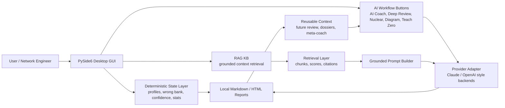
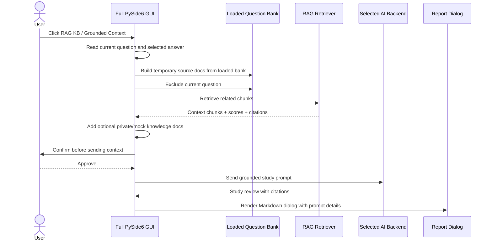
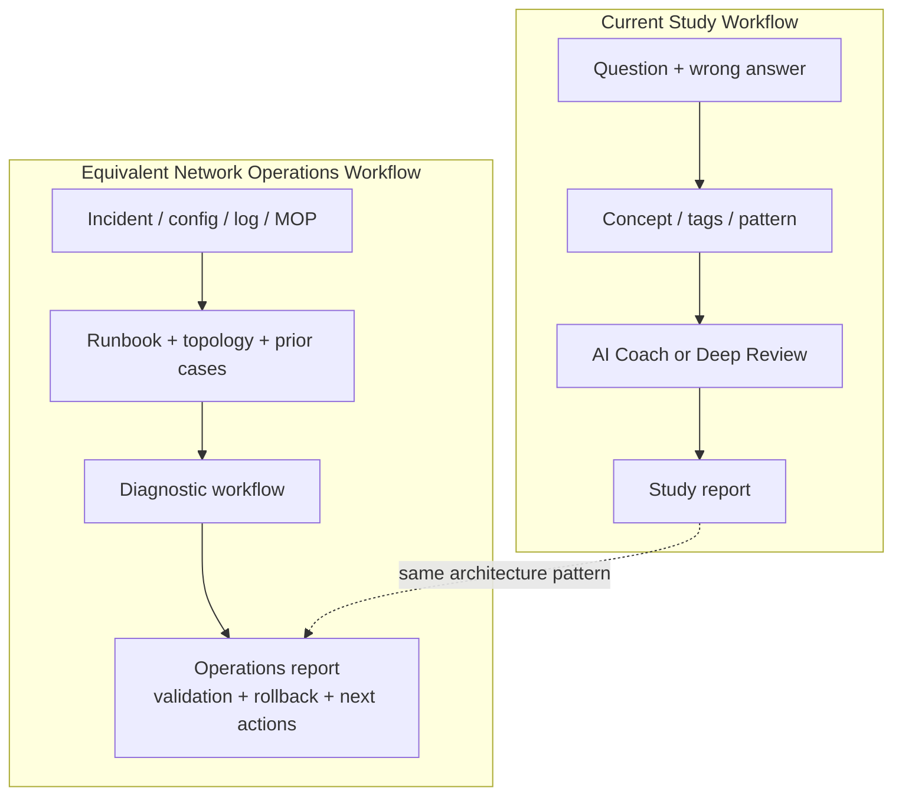
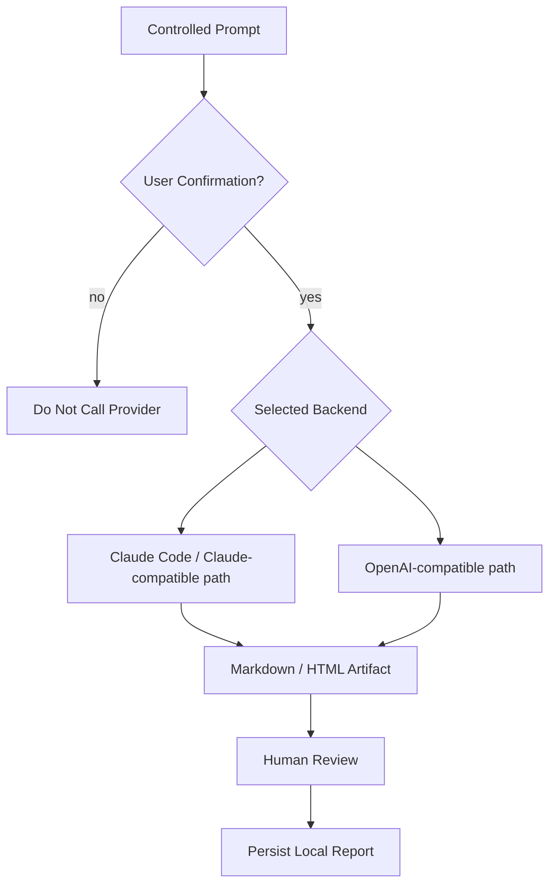
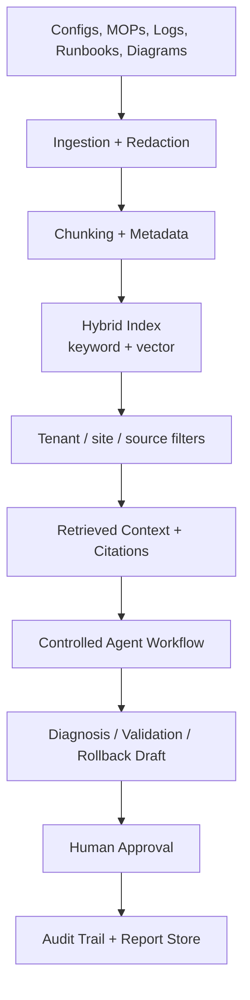

# Architecture Diagrams

These diagrams are safe for GitHub because they describe the system architecture
without showing private question banks, customer data or generated reports.

## System Overview



## RAG KB Flow In The Full GUI



## Study Workflow To Network Operations Mapping



## Data Safety Boundary

```mermaid
flowchart LR
    subgraph Public_Repo[Public GitHub Repo]
        Code[Application Code]
        Mock[Synthetic Mock Data]
        Docs[Architecture Docs]
        Tests[Tests + Safety Scan]
    end

    subgraph Local_Private[Local Private Machine]
        Banks[Real DOCX / CSV Inputs]
        Env[.env / API Keys]
        Logs[Logs]
        Generated[Generated Reports / Dossiers]
    end

    Code --> Runtime[Runtime Only]
    Runtime --> Banks
    Runtime --> Env
    Runtime --> Generated

    Local_Private -.blocked by .gitignore.-> Public_Repo
```

## Provider And Safety Model



## Future Enterprise Version


